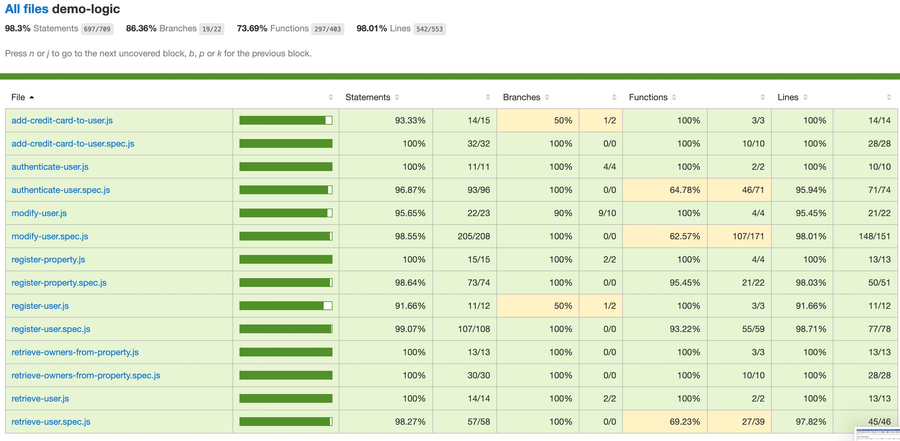

# x

## Introduction

...

## Functional description

...

### Use cases

### Activities

#### Register and Login

## Technical description

### Blocks

### Sequences

#### Register user

### Data model

### Code coverage

### Technologies

<table>
    <row>
        <td>
            
        </td>
        <td>
            
        <td>
    </row>
</table>